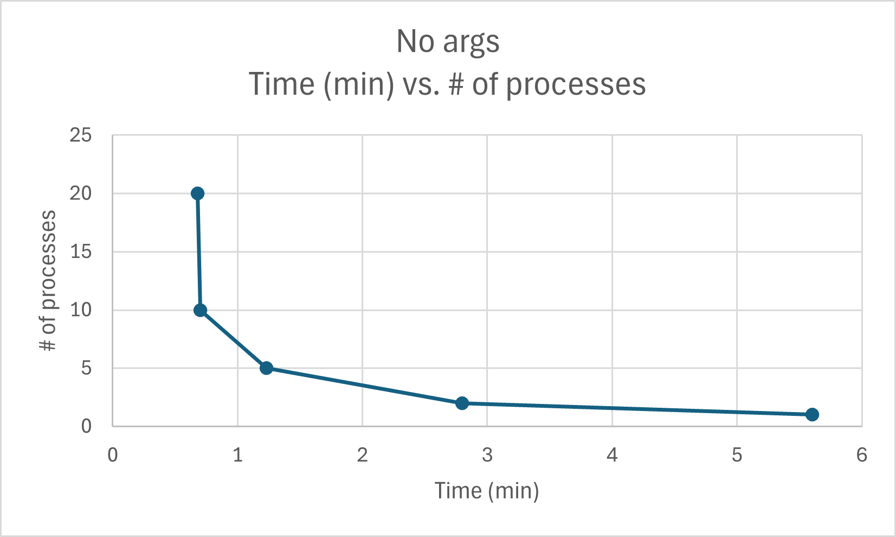

# System Programming Lab 11 Multiprocessing
## Implementation update:
    Used two for loops and fork to split image generation among a specified number of child processes. Added -p argument the specify number of processes. Updated scaling by implementing a zoom factor to slightly zoom in for each frame. Created a buffer to allow outfile names to be iterated.

note: ran with ./mandel -x -0.746415 -y -0.184298 -m 6996 -p \(processes\)

Process times:

1 process:      10m28s

2 processes:    9m20s

5 processes:    5m23

10 processes:   2m55s

20 processes:   1m55s

process times \(no args\):

1 process:      5m36s

2 processes:    2m48s

5 processes:    1m14s

10 processes:   0m42s

20 processes:   0m41s

## Results
    Process times exponentially decreased for both runs. Improvements from 1 to 2 processes were greater without arguments, while overall performance was increased with more processes when more arguments were specified.